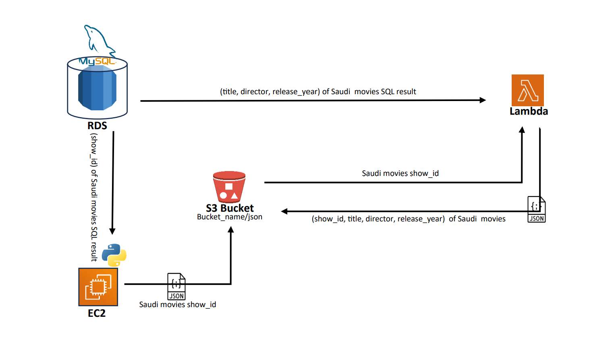

## AWS Services Integration
### Overview:
#### in this project i used a various AWS services, i used s3 Bucket, EC2, RDS, and lambda function, in this project i used a <a href="https://www.kaggle.com/datasets/shivamb/netflix-shows">Netflix Movies and TV Shows dataset </a>from kaggle to practice on these main services in AWS.

### Walking Through the Project:

##### In this project i create:

* RDS (mysql server)
* S3 Bucket
* EC2 Instance
* Lambda Function

 The structue of this project start from the <a href="https://www.kaggle.com/datasets/shivamb/netflix-shows"> dataset </a>i used from kaggle, I upload it to (mysql server) which i connected to AWS RDS service.

In EC2, I created a Python script to generate a JSON file and then placed it into an S3 Bucket.

#### Packages used in the Python script:
| Package | Usage | Installation Command |
| --------| ------| ---------------------|
| mysql.connector | Connecting to MySQL databases | `pip install mysql-connector-python`|
| boto3 | Interacting with AWS services	 | `pip install boto3`|

In this script, I utilize the `sql.connector` package to execute a query aimed at retrieving the `show_id` of Saudi movies available on the Netflix platform. The result of this query is then formatted into a JSON file, which is uploaded to an S3 Bucket by utilize `boto3` package, specifically within the `json/` folder.

Finally, In the lambda function, I focus on configuring it for three main tasks:
* **Granting Permissions:** I enable access to the S3 Bucket by configuring appropriate permissions..
* **Establishing Database Connection:** I create a connection from the lambda function to the RDS database.
* Adding layer to my lambda function to handle the packages, which i explained in this repo how i did it, you can go to `lambda-function/lambda-layers/creating_layers.md` or click on this link here <a href="https://github.com/kldplace/aws-services-integration/blob/main/lambda-function/lambda-layers/creating_layers.md"> **creating lambda layers** </a>
* **Adding Lambda Layers:** I enhance the functionality by incorporating lambda layers to manage packages efficiently. Details of this process and how i did it explained in the repository under `lambda-function/lambda-layers/creating_layers.md`, which you can access <a href="https://github.com/kldplace/aws-services-integration/blob/main/lambda-function/lambda-layers/creating_layers.md"> **here** </a>.

after that i write a script in the lambda handler, to connect with:
*  RDS database to querying the saudi movies `title`, `director` and `release_year` in the netflix platform.
* And connect with s3 Bucket to getting the result from json file i created in the previous step when i worked in EC2. 

